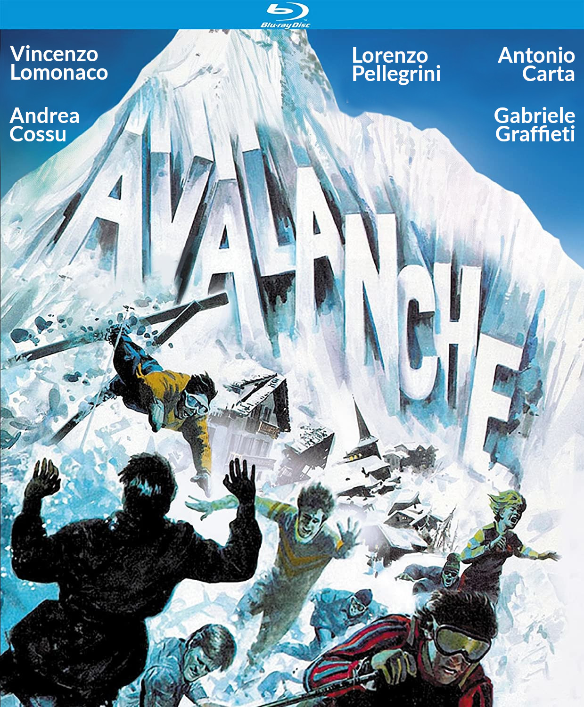

# The People

## 🗂️ Maintainers

The Project is maintained mostly by [ContinualAI Research](https://www.continualai.org/research) members, with the core mission of supporting the production, organization and dissemination of original research on CL with **technical research**, **open source projects** and **tools** that can make the life of a CL researcher easier.

* [**Vincenzo Lomonaco**](https://www.vincenzolomonaco.com/) 
* \*\*\*\*[**Lorenzo Pellegrini** ](https://www.unibo.it/sitoweb/l.pellegrini)\*\*\*\*
* \*\*\*\*[**Andrea Cossu**](https://andreacossu.github.io/)\*\*\*\*
* \*\*\*\*[**Gabriele Graffieti**](https://www.unibo.it/sitoweb/gabriele.graffieti/en)\*\*\*\*
* \*\*\*\*[**Antonio Carta**](http://pages.di.unipi.it/carta/) ****

## 🔨 Contributors

_Avalanche_ is a large community effort. It is only fair to list here all the people who made it a great tool that anyone can use without any restrictions at all!

* Qi She
* Keeiland Kooper
* Jeremy Forest
* Davide Maltoni
* Prashant Kumar Rai
* Tyler Hayes
* Marc Masana
* Eden Belouadah
* Adrian Popescu
* Gido van de Ven
* Martin Mundt
* Matthias De Lange
* _...see the_ [_full list on GitHub_](https://github.com/ContinualAI/avalanche/graphs/contributors)_!_

## 👪 Users

_Avalanche_ is a great tool also thanks to its many users. Here we list some research groups using _Avalanche_ for their continual learning research:

* [**ContinualAI Lab**](https://www.continualai.org/lab/) \(Director: Vincenzo Lomonaco\)
* [**BioLab** ](http://biolab.csr.unibo.it/home.asp)\(Director: Davide Maltoni, University of Bologna\)
* [**Computational Intelligence & Machine Learning Group**](http://ciml.di.unipi.it/index.html) \(Director: Alessio Micheli, University of Pisa\)
* [**Italian Association for Machine Learning**](https://iaml.it/) \(President: Simone Scardapane,  Sapienza University\)
* [**AIforPeople**](https://www.aiforpeople.org/) \(President: Marta Ziosi, University of Oxford\)
* _...and many more!_ 

## 📫 Contacts

If you want to contact us don't hesitate to send an email to `vincenzo.lomonaco@continualai.org`, `contact@continualai.org`, or you can join us [on slack](https://join.slack.com/t/continualai/shared_invite/enQtNjQxNDYwMzkxNzk0LTBhYjg2MjM0YTM2OWRkNDYzOGE0ZTIzNDQ0ZGMzNDE3ZGUxNTZmNmM1YzJiYzgwMTkyZDQxYTlkMTI3NzZkNjU) and chat with us all! 😃

