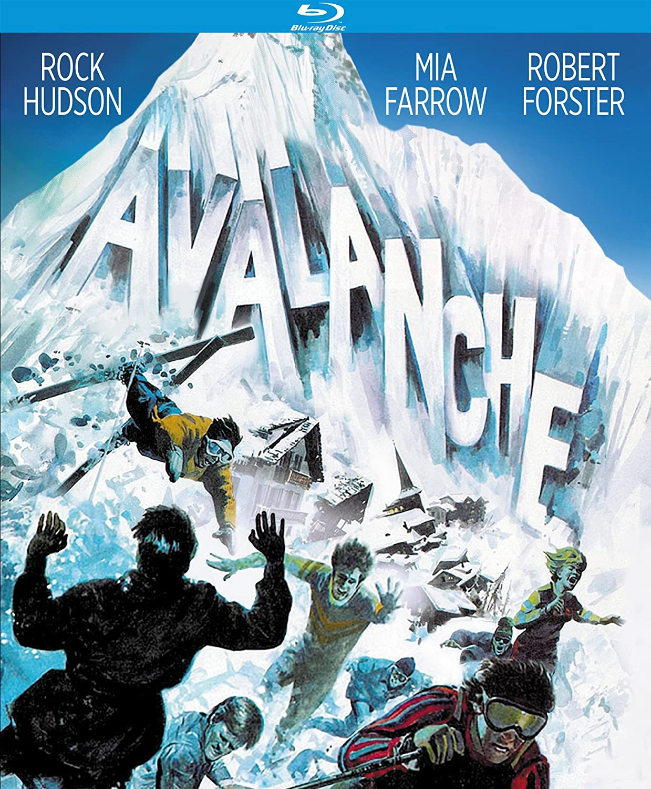

# The Team

## 🗂️ Maintainers 

The Project is maintained mostly by [ContinualAI Research](https://www.continualai.org/research) members, with the core mission of supporting the production, organization and dissemination of original research on CL with **technical research**, **open source projects** and **tools** that can make the life of a CL researcher easier.

* [Vincenzo Lomonaco](https://www.vincenzolomonaco.com/) 
* Lorenzo Pellegrini 
* Andrea Cossu
* Gabriele Graffieti
* Antonio Carta 

## 🔨 Contributors 

_Avalanche_ is a large community effort. It is only fair to list here all the people who made it a great tool that anyone can use without any restrictions at all!

* Qi She
* Keeiland Kooper
* Jeremy Forest
* Davide Maltoni

## 📫 Contacts 

If you want to contact us don't hesitate to send an email to `vincenzo.lomonaco@continualai.org`, `contact@continualai.org`, or you can join us [on slack](https://join.slack.com/t/continualai/shared_invite/enQtNjQxNDYwMzkxNzk0LTBhYjg2MjM0YTM2OWRkNDYzOGE0ZTIzNDQ0ZGMzNDE3ZGUxNTZmNmM1YzJiYzgwMTkyZDQxYTlkMTI3NzZkNjU) and chat with us all! 😃

